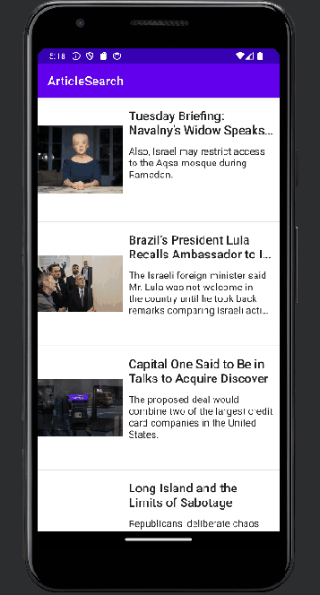

# Lab 4 - *ArticleSearch*

Submitted by: **Jalen Olsen**

**ArticleSearch** is an android app that allows the user to scroll through emails.

Time spent: **2** hours spent in total

## Required Features

The following **required** functionality is completed:

* [X] Articles are displayed using the RecyclerView
* [X] Can navigate to the Article Details screen
* [X] Article images are downloaded and displayed using Glide

## Video Walkthrough

Here's a walkthrough of implemented features:

<!-- Replace this with whatever GIF tool you used! -->
GIF created with ScreenToGif  
<!-- Recommended tools:
[Kap](https://getkap.co/) for macOS
[ScreenToGif](https://www.screentogif.com/) for Windows
[peek](https://github.com/phw/peek) for Linux. -->

## Notes

None

## License

    Copyright 2024 Jalen Olsen

    Licensed under the Apache License, Version 2.0 (the "License");
    you may not use this file except in compliance with the License.
    You may obtain a copy of the License at

        http://www.apache.org/licenses/LICENSE-2.0

    Unless required by applicable law or agreed to in writing, software
    distributed under the License is distributed on an "AS IS" BASIS,
    WITHOUT WARRANTIES OR CONDITIONS OF ANY KIND, either express or implied.
    See the License for the specific language governing permissions and
    limitations under the License.
